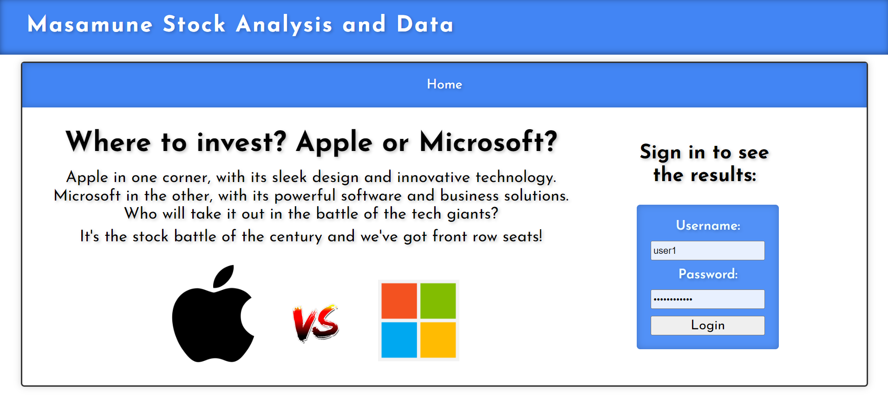
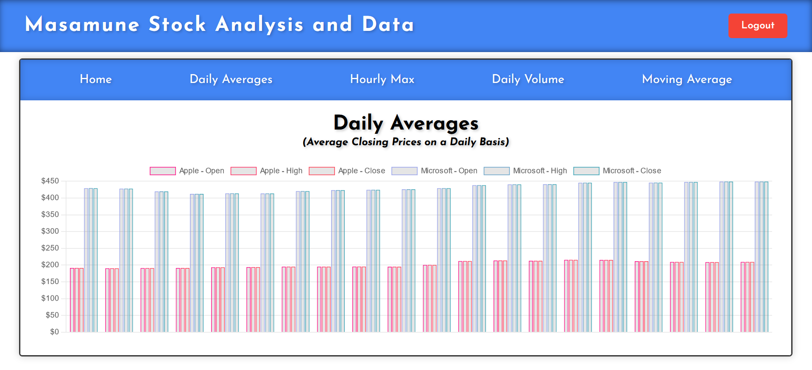

# Apple Vs Microsoft Stock Analysis

[https://tim-broderick.com/applevsmicrosoft](https://tim-broderick.com/applevsmicrosoft)

### NOTE:
*This is a (much nicer) React / TS frontend for my [Super Simple Analysis](https://github.com/TimBroderick44/Simple-Stock-Analysis) project.

This React / TypeScript frontend presents the user with a clear presentation of the Microsoft and Apple stock data through the charts.js library. Using the tabs at the top of the page, the user can easily navigate and find the display of data they require.

## Screenshots
 
 
 
 
 

## Highlights
- **Modern React/TypeScript Frontend**: Provides a more dynamic and interactive user experience.
- **Chart.js Library**: Utilized for clear and concise data visualization.
- **User-Friendly Navigation**: Tabs for easy access to different data visualizations.
- **Seamless Integration**: Works in conjunction with the backend data processing from the Super Simple Analysis project.

## How to Get Started

<details>
<summary> Building Locally </summary>

1. **Clone the Repository**:
    ```sh
    git clone https://github.com/TimBroderick44/Simple-Stock-Analysis-React-Frontend
    ```
2. **Install Dependencies**:
    ```sh
    cd Simple-Stock-Analysis-React-Frontend
    npm install
    ```
3. **Build the Project**:
    ```sh
    npm run build
    ```
</details>

<details>
<summary> Uploading to your EC2 Instance </summary>

1. **Transfer Build Files**:
    - Connect to your EC2 instance via SSH.
    - Upload the contents of the `dist` folder to your `build` directory on the EC2 instance using [WinSCP](https://winscp.net/eng/docs/guide_amazon_ec2)
</details>

<details>
<summary>Updating 'app.py'</summary>

1. **Modify app.py**:
   
    Ensure your `app.py` looks like this:

    ```python
    from flask import Flask, jsonify, render_template, request, send_from_directory
    import pandas as pd
    import boto3
    from io import BytesIO

    app = Flask(__name__, static_folder='build', static_url_path='')

    def read_from_s3(bucket_name, file_name):
        s3 = boto3.client('s3')
        obj = s3.get_object(Bucket=bucket_name, Key=file_name)
        return pd.read_csv(BytesIO(obj['Body'].read()))

    bucket_name = 'simple-stock-analysis'

    @app.route('/')
    def home():
        return send_from_directory(app.static_folder, 'index.html')

    @app.route('/api/daily_avg', methods=['GET'])
    def get_daily_avg():
        df = read_from_s3(bucket_name, 'daily_avg.csv')
        return jsonify(df.to_dict(orient='records'))

    @app.route('/api/hourly_max', methods=['GET'])
    def get_hourly_max():
        df = read_from_s3(bucket_name, 'hourly_max.csv')
        return jsonify(df.to_dict(orient='records'))

    @app.route('/api/daily_volume', methods=['GET'])
    def get_daily_volume():
        df = read_from_s3(bucket_name, 'daily_volume.csv')
        return jsonify(df.to_dict(orient='records'))

    @app.route('/api/moving_avg_close', methods=['GET'])
    def get_moving_avg_close():
        df = read_from_s3(bucket_name, 'moving_avg_close.csv')
        return jsonify(df.to_dict(orient='records'))

    @app.route('/<path:path>')
    def static_proxy(path):
        return send_from_directory(app.static_folder, path)

    if __name__ == '__main__':
        app.run(host='0.0.0.0', port=5000)
    ```

2. **Run the Flask Application**:
    ```sh
    python app.py
    ```

3. **Access the Application**:
    Navigate to your EC2 instance's IP address in a web browser to see your React application served by Flask.
</details>

## Lessons Learned
- Implementing libraries designed for plain JS into React / TS
- Integration of a modern frontend framework with a Flask backend service hosted on an EC2 instance. 
- Efficient data fetching and state management in a React/TypeScript environment.

## Difficulties
- Configuring the build process and ensuring all dependencies are correctly installed.
- Configuring the Charts.js library so as to function correctly in this new environment.
- Managing cross-origin requests and data flow between the frontend and backend.

## Future Implementations
- Adding more visualizations and data metrics.
- Implementing real-time data updates.
- Enhancing the user interface with more interactive features.
- Adding user authentication and personalized data views.
